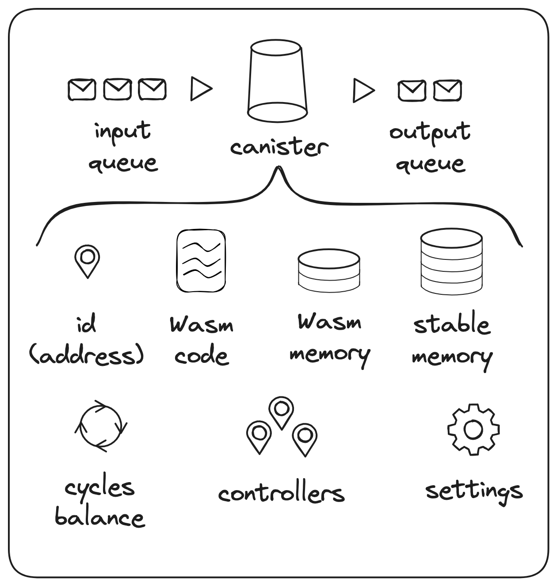

import TeamContact from '../../contact.md';

# 概览

## 简介

在 ICP 上运行的智能合约是传统智能合约的进化版本。ICP 上的智能合约被称为[容器](https://ic123.xyz/docs/getting-started/ic-glossary/#canister)，是将代码和数据结合在一起的计算单元。容器可以包含任意代码或数据，它可以用来提供网页服务、开发安全的消息应用，甚至实现去中心化的代币交易所。

容器具有一些特殊属性，允许开发人员构建可扩展的 Web3 服务。为了更好地理解这些属性，我们需要从不同角度去理解容器、以形成对其能力的完整图景。

- 以太坊开发人员可能将容器视为智能合约。
- 学术背景的人可能会将其与 Actor 和 [Actor Model](https://en.wikipedia.org/wiki/Actor_model) 联系起来。
- 系统工程师可能会联系到操作系统进程。
- 虚拟机专家则可能会认为是 WebAssembly 模块实例。

这些理解方式某种程度上都是正确的，综合起来它们共同构成了容器的全景图。接下来让我们逐一分析这些不同的理解。

### 容器作为智能合约

容器在很多方面类似于智能合约，容器的执行受到安全协议（在当前上下文是指 ICP 协议）的约束。在 ICP 上运行的容器是防篡改的，因为容器的状态只能通过在链上执行的消息来修改。而容器的状态可以通过 ICP 的[链钥](https://ic123.xyz/docs/getting-started/ic-glossary/#chain-key)密码学进行审计和加密验证。对容器和以太坊智能合约的简要比较，可以参考[该表格](https://ic123.xyz/docs/getting-started/icp-overview/#comparison-with-ethereum)。

### 容器作为 Actors

从抽象的角度来看，容器与 Actors 有很多相似之处。容器遵循并发计算的 [Actor 模式](https://en.wikipedia.org/wiki/Actor_model)，并通过执行以下一项或多项操作来响应接收到的消息：

- 修改容器的私有状态。
- 向其他容器 (Actors) 发送消息。
- 创建更多的容器 (Actors)。

尽管容器只有一个执行线程，但可以同时执行多个容器。这是 ICP 的一个关键特性，并因此克服了其他智能合约平台的所面临的可扩展性问题。

### 容器作为操作系统进程

容器在很多方面类也似于操作系统进程。

- ICP 调度容器的执行，类似于操作系统调度进程。
- ICP 代表容器维护状态，例如容器的 cycles 余额、或对其他容器的未完成调用；这类似于操作系统代表进程维护状态，例如进程打开的文件描述符等。
- 容器不能直接修改其 cycles余额，类似于操作系统进程不能直接修改其文件描述符表或操作外围设备。

ICP 为容器提供了 APIs，允许容器创建和管理其他容器，并向其他容器进行支付、或发送消息。

### 容器作为 WebAssembly 模块实例

容器是以 WebAssembly 模块的形式实现的，这使得开发者可以使用多种支持 WebAssembly 的编程语言编写容器、从而实现最大的互操作性。

一个容器即是一个完整的 WebAssembly 模块实例，具有自己的状态和执行堆栈。容器的内存使用正交持久性 ([Orthogonal Persistence](https://medium.com/dfinity/ic-internals-orthogonal-persistence-9e0c094aac1a))，这使得容器存储数据对用户来说是透明的。容器的 WebAssembly 模块数据会被系统自动持久化，并在下次调度执行该容器时呈现。WebAssembly 模块本身与容器状态的其他部分一起存储。

## 深入容器

容器是 WebAssembly (Wasm) 程序，但容器在标准 Wasm 代码和内存之外还具有一些其他组件以实现：

- 存储持久数据；
- 与用户和其他 Canisters 进行通信；
- 并由 DAO 等实体进行管理；

等功能。下图简单描述了这些组件：

### 容器 ID

每个容器都有一个唯一的标识符，通常称为容器的地址或[主体](https://ic123.xyz/docs/getting-started/ic-glossary/#principal)。当用户或容器向另一个容器发送消息时，它们在消息头中通过容器 ID 指定目标容器；然后系统将消息路由到目标容器，并将该消息添加到该容器的输入队列中。

### 输入队列

容器具有用于接收消息的队列。当容器被调度执行时，它会从队列中获取一条消息，并运行由该消息指定的对应的 Wasm 函数。函数的代码存储在容器的 Wasm 二进制文件中。在执行过程中，函数读取消息的有效载荷 (payload)，并修改存储在容器中的数据。

:::info
队列中消息的顺序取决于具体实现，不一定要是先进先出 (FIFO)。
:::

### 容器的存储
容器可以使用两种类型的存储：Wasm 内存和稳定内存 (stable memory)。函数无需特别操作即可使用 Wasm 内存，这种内存会自动用于堆分配的对象。目前：

- Wasm 内存是 32 位，最大限制为 4GiB；
- 稳定内存则是 64 位，允许容器扩展到超过 4GiB。

您的代码可以通过调用有关稳定内存的[系统函数](https://internetcomputer.org/docs/current/references/ic-interface-spec#system-api-stable-memory)（例如 `stable64_read` 和 `stable64_write`）来访问稳定内存。

Wasm 内存和稳定内存在某种意义上都是持久的，即系统在消息成功执行后会自动提交所有内存修改。反之如果消息执行失败，则不会提交更改。

在容器升级新的 Wasm 代码时，Wasm 内存和稳定内存之间的区别变得很重要：

- 容器升级会清除 Wasm 内存；
- 但容器升级会保留稳定内存，因此我们称之为稳定内存。

### 输出队列

在执行过程中，容器可能会向其他容器发送消息。在成功执行后，这些消息被排入容器的输出队列中。随后，ICP 将这些消息传递给目标容器进行处理。

:::info
容器之间的调用是基于消息实现的。每个调用由两个消息组成：

- 来自调用者到被调用者的调用消息；
- 来自被调用者到调用者的响应消息。
:::

### 周期余额

容器使用 cycles 来支付执行所需的费用。而执行的成本取决于执行的 Wasm 指令数量和类型。需要注意的是，不管执行是否成功，系统都会从容器的 cycles 余额中扣除已执行的费用。

### 控制者

只有容器的[控制者](https://ic123.xyz/docs/getting-started/ic-glossary/#controller)才能对容器进行某些系统级操作，例如启动容器、停止容器、升级容器等。控制者主体的列表存储在容器中，用户和容器都可以成为控制者。

如果某个容器没有控制者，那么在某种意义上它是不可变的，即容器 Wasm 代码无法更改。

### 设置

容器还具有其他多种可以由控制者修改的设置和标志。例如，控制者可以设置容器的冻结阈值，使其在 cycles 不足时变为冻结状态（在冻结状态下，容器不会执行消息、以减少 cycles 的消耗）。

了解更多设置，可以查看完整的[容器设置列表](https://internetcomputer.org/docs/current/references/ic-interface-spec#ic-create_canister)。

<TeamContact />
