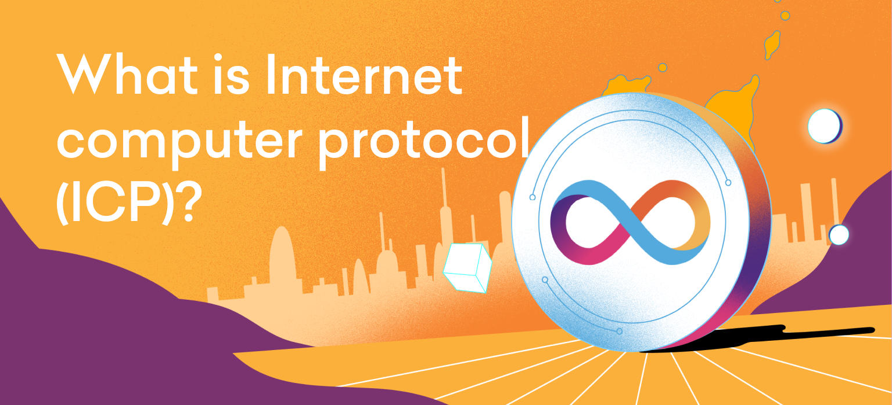
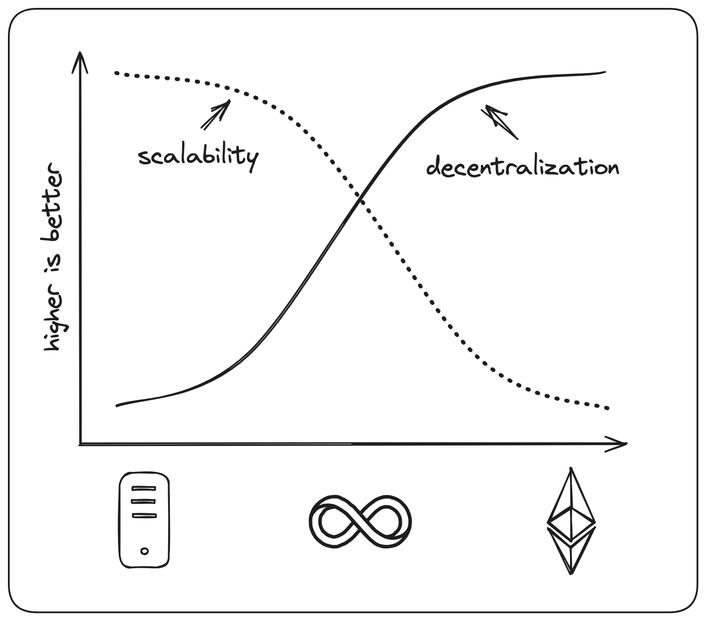
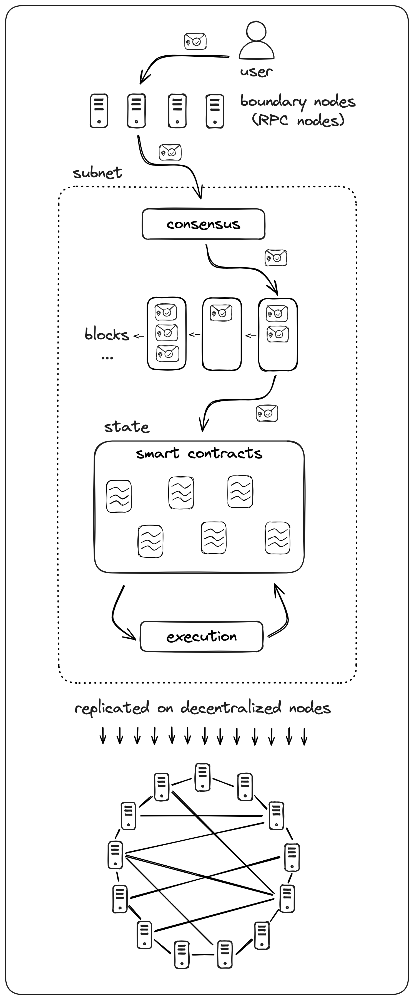
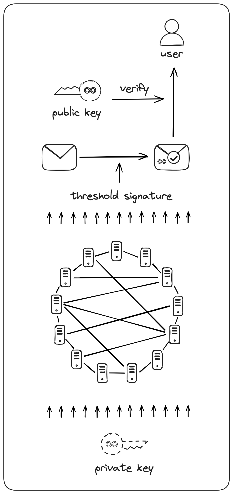
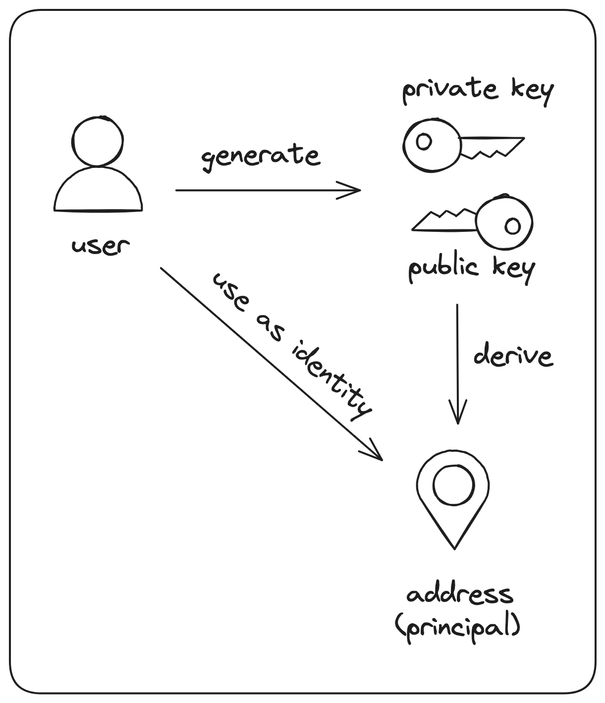

import TeamContact from '../../contact.md';

# ICP 概览 {#overview}



ICP (Internet Computer Protocol) 架起了传统编程与区块链开发之间的桥梁。ICP 上的智能合约既具有传统应用程序的表达性和可扩展性，又能从区块链的去中心化和去信任的执行中受益。

ICP 旨在在可扩展性和去中心化之间实现平衡。



从以上的概念图中可以看出，从中心化的服务器到以太坊 —— 去中心化程度在逐渐增加，但这是以可扩展性为代价的。ICP 位于曲线中间，致力于寻求可扩展性和去中心化之间的平衡。

以下我们将介绍 ICP 的核心概念和特性、以及设计的考量。

## 子网 {#subnets}

ICP 具备高可扩展性的关键因素之一是分片技术。ICP 将智能合约分片到多个区块链实例之上，每个实例称之为一个[子网](https://ic123.xyz/docs/getting-started/ic-glossary/#subnet)。每个子网都拥有一组独立的分布式节点，它们在彼此之间运行共识算法，构建自己的区块链、并执行智能合约。每个子网与其他子网并行运行，一个子网上的智能合约可以通过发送[消息](https://ic123.xyz/docs/getting-started/ic-glossary/#message)与另一个子网上的智能合约进行通信。用户也可以向智能合约发送消息。下图示展示了 ICP 的消息流程：



1. 消息首先发送到[边界节点](https://ic123.xyz/docs/getting-started/ic-glossary/#boundary-node)（RPC 节点）。

2. 边界节点将消息路由到托管目标智能合约的子网。

3. 子网的[共识](https://ic123.xyz/docs/getting-started/ic-glossary/#consensus)算法将消息添加到子网区块链的新区块中。

4. 消息被添加到目标智能合约的[输入队列](https://ic123.xyz/docs/getting-started/ic-glossary/#input-queue)中。

5. 智能合约执行消息。

:::info

上述步骤第 3-5 步是异步且解耦的，对于习惯于以太坊原子交易的开发人员需要注意。这种设计的动机是为了实现可扩展性。

:::

子网大小可以不同，这决定了在该子网上运行智能合约的成本，也会影响最终性和安全性。

## 门限签名 {#threshold-signatures}

ICP 的每个子网都有一个固定的公钥，而与之对应的私钥并不存储在单个节点上、也不会在任何节点上公开。相反，通过门限密码学，子网私钥被分割成多个秘密份额、并分布在所有子网节点上，节点可以使用这些秘密份额共同对发送给用户或其他子网的消息进行签名。这使得用户验证状态和结果变得很简单，他们只需使用子网固定的公钥验证数字签名、而无需下载并验证区块链中的区块。

这一特性具有深远的影响和用途：

- 不需要永久保留区块链中的区块，从而打破了可扩展性的瓶颈。事实上，ICP 会主动清理旧区块以控制存储量。

- 智能合约可以[拥有自己的密钥](https://medium.com/dfinity/how-icps-bitcoin-integration-secures-private-keys-c2af14597846)，并为其他区块链（如比特币和以太坊）签署交易。这也带来了与这些区块链的无需信任交互。



这一特性在 ICP 上被称为链钥密码学。

## 智能合约 {#smart-contracts}

ICP 使用 [WebAssembly](https://ic123.xyz/docs/getting-started/ic-glossary/#webassembly) 作为执行智能合约的虚拟机，这意味着开发人员可以使用流行的编程语言（如 JavaScript、TypeScript、Rust、Python 和专为 ICP 设计的 Motoko ）编写智能合约。

此外 ICP 的单个智能合约足够强大、可以托管整个以太坊虚拟机 (EVM)，这使得部署用 Solidity 编写的 EVM 智能合约成为了可能。

ICP 的一个独特特性是智能合约可以处理 HTTP 请求，并提供诸如 HTML、JS、CSS 等 Web 资源。换言之，您可以编写一个完全托管在链上的具有后端和前端的 Web3 应用程序。智能合约还可以向 ICP 之外的其他 Web2 服务发出请求。

以太坊开发人员可能习惯于智能合约在原子交易中按顺序运行，与之不同，ICP 支持可扩展性、并行地运行智能合约。在这一点上，ICP 的智能合约类似于传统编程中的进程或微服务。智能合约完全自主，可以使用定时器调度执行、而无需依赖用户发送消息。

在存储方面，智能合约可以在其 WebAssembly 内存中存储任意数据。此外，智能合约还可以使用更大的稳定内存。这两种内存之间的区别对于可升级的智能合约非常重要：WebAssembly 内存在升级时会被清除，而稳定内存则会保留（因此被称为“稳定”）。对于不可变的智能合约，除了大小和访问函数之外，两种内存之间没有明显的区别。

:::info

在 ICP 的上下文中，智能合约被称为[容器](https://ic123.xyz/docs/getting-started/ic-glossary/#canister)。

:::

## 账户与秘钥 {#accounts-and-keys}

ICP 通过对用户的公钥进行哈希运算来派生用户[账户](https://ic123.xyz/docs/getting-started/ic-glossary/#account)的地址。



地址的文本编码包含了如下所示的校验和：

```
mh4eq-xsi7l-lgz7s-gmxoh-stiey-277n4-lev4o-q6hah-22sk6-ahlhm-qae
```

ICP 支持多种类型的密钥 (ECDSA, Ed25519, BLS)。开发者工具通常生成和接受 PEM 格式的密钥。

由于智能合约可以拥有私钥，它们可以提供用户账户服务。[Internet Identity](https://ic123.xyz/docs/getting-started/ic-glossary/#internet-identity) 就是一个智能合约的示例，它允许 Web2 用户拥有区块链账户，同时私钥安全地存储在区块链上。您也可以使用硬件钱包和浏览器扩展钱包。

:::info

在 ICP 的上下文中，地址被称为 [principals](https://ic123.xyz/docs/getting-started/ic-glossary/#principal)。

:::

## 代币 {#tokens}

与其他链（如以太坊）相比，ICP 一个重大的设计不同在于账户没有内置余额。ICP 上所有代币都是由智能合约实现的。ICP 有一个与 ERC-20 标准等效的标准，称为 [ICRC-2](https://github.com/dfinity/ICRC-1/blob/main/standards/ICRC-2/README.md)。如果一个智能合约实现了 ICRC-2 标准，那么它实现了一个同质化代币、并拥有相应的账本。

## 消息 {#messages}

ICP 的编程模型类似于[参与者](https://ic123.xyz/docs/getting-started/ic-glossary/#actor)模式，它通过发送消息而不是事务来进行调用。事务和消息之间的区别在于智能合约调用其他智能合约的时候：
- 事务在某个调用失败时会原子性地回滚所有状态更改；
- 而消息在多个调用之间没有这样的原子性保证。
与以太坊相比，ICP 上的编程更加异步。如果智能合约不进行任何调用，那么消息的行为与事务完全相同。

## Cycles {#cycles}

在以太坊等其他区块链上，用户在发送和执行交易时需要根据当前的 gas 价格支付费用。为了简化用户使用 Web3 应用的体验，ICP 使用了一种“反向 gas 模型”，其中[容器](https://ic123.xyz/docs/getting-started/ic-glossary/#canister)通过 cycles 来支付所使用的资源。Cycles 类似于以太坊的 gas，但其价格是固定的、并与一组法定货币关联。

## 治理 {#governance}

ICP 的治理由一个名为 Network Nervous System ([NNS](https://ic123.xyz/docs/getting-started/ic-glossary/#network-nervous-system)) 的去中心化自治组织 (DAO) 负责。NNS 是一组运行在 ICP 上的智能合约，社区成员可以通过质押 ICP 代币、并对提案进行投票来参与治理。所有 ICP 的运营变更，例如升级节点等都需要经过投票。NNS 会自动执行已通过投票的提案，从而确保节点运行相同版本的协议、避免了硬分叉。

:::info

治理和节点所有权是解耦的，您可以在不拥有节点的情况下参与治理。

:::

## 节点 {#nodes}

成为 ICP 上的[节点提供者](https://ic123.xyz/docs/getting-started/ic-glossary/#node-provider)需要 DAO 社区的投票。这样做有两个原因：

1. 确保硬件符合 ICP 的标准：64 个 CPU 核心、512GB 的 RAM、30TB 的 NVMe SSD。这样的节点可以维持高吞吐量，以支持强大的 Web3 应用。

2. 确保节点提供者的身份为社区所知。节点提供者已签署了善意声明，如果节点行为不当可能会承担法律责任。这样做使得女巫攻击更难实施，并在保持 Nakamoto 系数高的同时减少节点数量。节点会根据运营商、地理位置和法域等因素分配到某个子网中，以最大程度地实现去中心化，我们称之为确定性去中心化。

目前子网包含的节点数量从 13 到 40 不等，大部分节点分布在不同地理位置。同时也可以有本地化的子网，以支持需要遵守当地法规的应用程序。

## 与以太坊的快速比较 {#comparison-with-ethereum}

|                             | Ethereum                                   |ICP                                     |
|:------------                |:-----------------------------------------|:-----------------------------------------|
|虚拟机                       | EVM                                      | WebAssembly                               |
|链上 Web3                    | ❌                                      | ✅                                        |
|无桥接比特币                  | ❌                                      | ✅                                       |
|智能合约签名消息               | ❌                                      | ✅                                       |
|智能合约向 Web2 发出 HTTP 请求 | ❌                                      | ✅                                       |
|编程语言                      | Solidity, Vyper, Yul                    | JS, Python, Rust, Solidity, Motoko 等      |
|编程模型                      | 原子交易                                 | 异步消息传递                               |
|可升级性                      | 不可变                                   | 可升级或不可变                             |
|Gas 模型                      | 用户支付                                 | 智能合约支付                               |
|Gas 价格                      | 可变                                     | 固定                                      |
|计算能力                      | 每区块几百万条指令（基于 3000 万 gas 限制） | 每区块 20 亿条指令（每个子网）              |
|最终性                        | 约 15 分钟                               | 约 1.4 秒                                 |
|平均交易或消息费用             | 约 $1                                    | 约 $0.000001                              |
|堆栈大小                      | 32KB（1024 个 256 位值）                  | 5MB                                       |
|代码大小                      | 24KB                                     | 10MB                                      |
|内存大小                      | 几 KB                                    | 404GiB（4GiB Wasm 内存 + 400GiB 稳定内存） |
|存储成本                      | 每 GiB $18M（基于每 KB 640K gas）         | 每年每 GiB $5                             |
|节点数量                      | 约 7K                                    | 总共约 500，每个子网 13-40                 |

<TeamContact />
